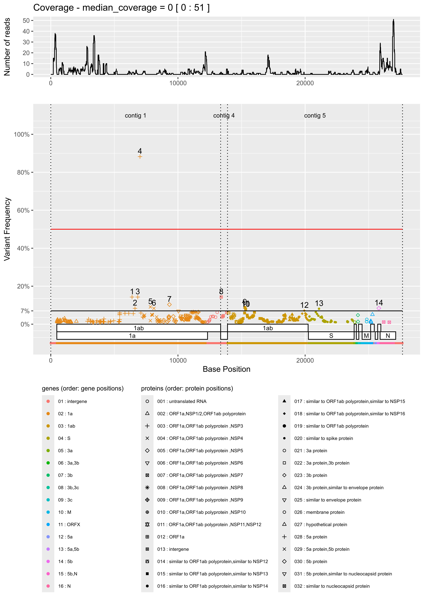

# vvv2_display

# Description

Tools to create:
- a .png image file describing all variants (obtained from vardict-java variant caller) alongside a genome/assembly (to provide) with their proportion (ordinates), with CDS descriptions (obtained from vadr annotator). At the top of the figure can be displayed the coverage depth repartition (if `-o cov_depth_f` option is provided).

Python/R scripts and Galaxy wrapper to use them.

It uses the results of:
- vadr >= 1.4.1 for annotation (of reference/assembly)
- vardict-java 1.8.3 for variant calling (of BAM alignement using reference/assembly and reads)

# Programs

- ```vvv2_display.py```: main script running each step of analyses
This script can be run independently, once __vvv2__ conda environment is installed and activated.
Type ```./vvv2_display.py``` then enter to get help on how to use it.

- ```PYTHON_SCRIPTS/convert_tbl2json.py```: 
Convert ```vadr``` annotation output .tbl file to json

- ```PYTHON_SCRIPTS/convert_vcffile_to_readablefile.py```: 
Convert ```vardict-java``` variant calling vcf file to human readable txt file

- ```PYTHON_SCRIPTS/correct_multicontig_vardict_vcf.py```: 
Correct ```vadr``` annotation output .tbl file for contigs positions when the assembly provided is composed of more than one contig.

<!-- - ```R_SCRIPTS/visualize_coverage_depth.R```: -->
<!-- Create a .png file showing coverage depth alongside the genome, from a bam alignment file. -->

- ```R_SCRIPTS/visualize_snp_v4.R```:
Create a .png file showing on the same png figure:
  - coverage depth repartition alongside the genome/assembly (if `-o cov_depth_d` option provided)
  - variant proportions alongside the genome/assembly and CDS positions.

# Installation

Use conda environment:
```
conda create -n vvv2_display -y
conda activate vvv2_display
mamba/conda install -c bioconda vvv2_display
```
Prefer mamba installation if completely new conda environments (faster). Do not mix mamba and conda.

Description:
```
vvv2_display.py -h
```

Typical usage:
```
vvv2_display.py -p res_vadr_pass.tsv -f res_vadr_fail.tsv -s res_vadr_seqstat.txt -n res_vardict_all.vcf -r res_vvv2_display.png -o cov_depth_f.txt
```
where:
  - `res_vadr_pass.tsv` is the 'pass' file of vadr annotation program run on the genome/assembly
  - `res_vadr_fail.tsv` is the 'fail' file of vadr annotation program
  - `res_vadr_seqstat.txt` is the 'seqstat' file of vadr annotation program
  - `res_vardict_all.vcf` is the result of vardict-java variant caller
  - `res_vvv2_display.png` is the name of the main output file (will be created)
  - `cov_depth_f.txt` is the coverage depth by position, provided by `samtools depth` run on the bam alignement file.

> All other options are for Galaxy wrapper compatibility (these are intermediate temporary files that must appear as parameter for Galaxy wrapper but are not used in a usual command line call)

# Output example

Example is obtained on Turkey Coronavirus sequencing data, with as reference, the first draft assembly.

* png file:



> Vertical dash lines show contigs separations

* tsv summary file:
```
indice	position	ref	alt	freq	gene	prot	lseq	rseq	isHomo*
1	6388	A	G	0.1429	1a	ORF1a,ORF1ab polyprotein [exception ribosomal slippage],NSP3  putative papain-like protease	GTATTGTAGAAATTGTGATG	GTATGGTCATCAAAATACAT	no
2	6622	A	G	0.0833	1a	ORF1a,ORF1ab polyprotein [exception ribosomal slippage],NSP3  putative papain-like protease	GAAGAAAGCTGTTTTTCTTA	GGAAGCATTGAAATGTGAAC	no
3	6838	A	G	0.1429	1a	ORF1a,ORF1ab polyprotein [exception ribosomal slippage],NSP3  putative papain-like protease	AGTTTGTGACATTTTGTCTA	TATAATTTCTGTAGATACTG	no
4	7014	R	A	0.8824	1a	ORF1a,ORF1ab polyprotein [exception ribosomal slippage],NSP3  putative papain-like protease	TACCGTCATATGGTATAGAC	CTGATAAATTAACACCTCGT	no
5	7833	G	A	0.0909	1a	ORF1a,ORF1ab polyprotein [exception ribosomal slippage],NSP4	ATTGTTTTAATGGTGATAAT	ATGCACCTGGAGCTTTACCA	no
6	8110	T	A	0.0833	1a	ORF1a,ORF1ab polyprotein [exception ribosomal slippage],NSP4	AGAACTTATGTTTAATATGG	TAGTACATTCTTTACTGGTG	no
7	9328	A	G	0.1034	1a	ORF1a,ORF1ab polyprotein [exception ribosomal slippage],NSP5  putative 3C-like proteinase	TGCATTACACACTGGAACGG	CCTACATGGTGAGTTCTATG	no
8	13404	A	C	0.1429	intergene	intergene	GTTAGTGGGAACATCCAATA	TTTAGTTGATCTTAGAACGT	no
9	15255	A	T	0.0882	1ab	similar to ORF1ab polyprotein,similar to NSP13:GBSEP:putative helicase	CTGTGGTAATCATAAACCAA	GTTGTCAATACCGTTAGTAT	no
10	15319	C	T	0.0769	1ab	similar to ORF1ab polyprotein,similar to NSP13:GBSEP:putative helicase	TACAGGGCTAATTGTGCTGG	AGCGAAAATGTTGATGATTT	no
11	15326	A	G	0.08	1ab	similar to ORF1ab polyprotein,similar to NSP13:GBSEP:putative helicase	CTAATTGTGCTGGCAGCGAA	ATGTTGATGATTTTAATCAA	yes
12	19937	G	A	0.0714	1ab	similar to ORF1ab polyprotein,similar to NSP16:GBSEP:putative 2-O-ribose methyltransferase	TAACAGAGACAAGTTGGCAC	AAAATTTATATGACATTGCA	no
13	21092	T	C	0.0811	S	similar to spike protein	TTACGTGGTGATAACACTGG	GTTTCTTATGATTATCAGTG	no
14	25794	TT	AA	0.0838	5b	5b protein	AGGATTAGATTGTGTTTACT	CTTAACAAAGCAGGACAAGC	no

*NB: an homopolymer region is set to 'yes' if there is a succession of at least 3 identical nucleotides.
     it looks like a restrictive measure, but Ion Torrent and Nanopore sequencing are very bad on such region, so make sure you verify these variants.
```

# Galaxy wrapper

- ```vvv2_display.xml```:
Allow Galaxy integration of ```vvv2_display.py```. vvv2_display can be used in Galaxy pipelines.

# Citation

Please, if you use __vvv2_display__ and publish results, cite:
- Lai, Zhongwu, Aleksandra Markovets, Miika Ahdesmaki, Brad Chapman, Oliver Hofmann, Robert McEwen, Justin Johnson, Brian Dougherty, J. Carl Barrett, and Jonathan R. Dry. “__VarDict__: A Novel and Versatile Variant Caller for next-Generation Sequencing in Cancer Research.” Nucleic Acids Research 44, no. 11 (June 20, 2016): e108–e108. https://doi.org/10.1093/nar/gkw227.
- Schäffer, Alejandro A., Eneida L. Hatcher, Linda Yankie, Lara Shonkwiler, J. Rodney Brister, Ilene Karsch-Mizrachi, and Eric P. Nawrocki. “__VADR__: Validation and Annotation of Virus Sequence Submissions to GenBank.” BMC Bioinformatics 21, no. 1 (December 2020): 211. https://doi.org/10.1186/s12859-020-3537-3.
- Flageul, Alexandre, Pierrick Lucas, Edouard Hirchaud, Fabrice Touzain, Yannick Blanchard, Nicolas Eterradossi, Paul Brown, and Béatrice Grasland. “__Viral Variant Visualizer (VVV)__: A Novel Bioinformatic Tool for Rapid and Simple Visualization of Viral Genetic Diversity.” Virus Research 291 (January 2021): 198201. https://doi.org/10.1016/j.virusres.2020.198201.

